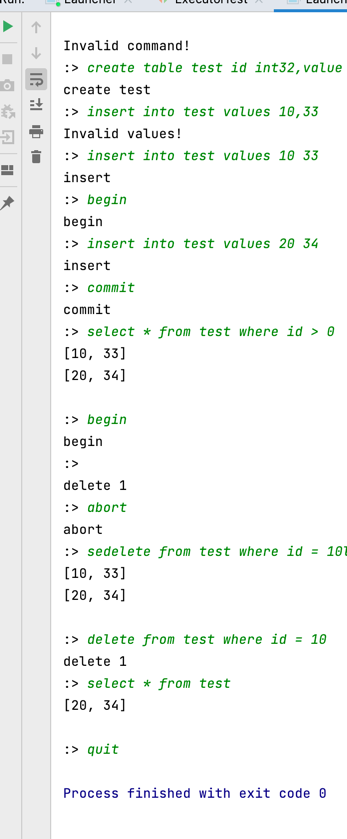

# ApoloDB

ApoloDB 是一个 Java 实现的简单的数据库。实现了以下功能：

- redo日志事务提交
- 两种事务隔离级别（读提交和可重复读MVCC）
- 简单的表和字段管理
- 简陋的 SQL 解析（因为懒得写词法分析和自动机，就弄得比较简陋）
- 基于 socket 的 server 和 client

## 运行方式

注意首先需要在 pom.xml 中调整编译版本，如果导入 IDE，请更改项目的编译版本以适应你的 JDK

首先执行以下命令编译源码：

```shell
mvn compile
```

接着执行以下命令以 /tmp/mydb 作为路径创建数据库：

```shell
mvn exec:java -Dexec.mainClass="com.db.apolo.backend.Launcher" -Dexec.args="-create /tmp/mydb"
```

随后通过以下命令以默认参数启动数据库服务：

```shell
mvn exec:java -Dexec.mainClass="com.db.apolo.backend.Launcher" -Dexec.args="-open /tmp/mydb"
```

这时数据库服务就已经启动在本机的 9999 端口。重新启动一个终端，执行以下命令启动客户端连接数据库：

```shell
mvn exec:java -Dexec.mainClass="com.db.apolo.client.Launcher"
```

会启动一个交互式命令行，就可以在这里输入类 SQL 语法，回车会发送语句到服务，并输出执行的结果。

一个执行示例：

